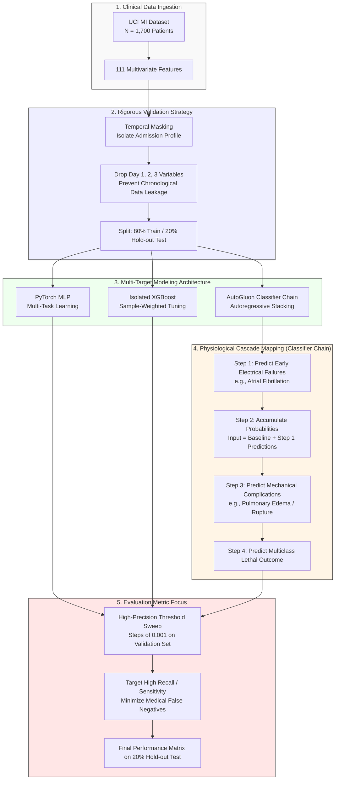

# Myocardial Infarction Prediction

Analysing a [database](https://archive.ics.uci.edu/dataset/579/myocardial+infarction+complications) with Myocardial Infarction data to predict complications associated with symptoms in pacients.

---

## Student: João Gabriel Machado
## Professor: Claudio Jose Struchiner - FGV EMAp

---

## Project Overview
This project focuses on predicting **12 distinct clinical complications** (11 binary outcomes like Myocardial Rupture, Heart Failure, and Arrhythmias, plus 1 multiclass lethal outcome) that can occur within 72 hours following an acute Myocardial Infarction (MI). 

Predicting these complications early (at the moment of hospital admission) allows clinical teams to shift from a *reactive* approach to a *preventative* one, optimizing ICU resources and saving lives.



## The Dataset
We use the **Myocardial Infarction Complications Data Set** from the UCI Machine Learning Repository, collected at the Krasnoyarsk Interdistrict Clinical Hospital.

* **Instances:** 1,700 patients.
* **Features:** 111 clinical variables spanning demographics, medical history (anamnesis), initial ECG findings, lab biomarkers (such as Electrolytes and Enzymes), and vitals.
* **The Challenges:** The data presents **extreme class imbalance** (severe complications are rare) and severe **missingness (MNAR)**, reflecting real-world emergency triage where not all tests are performed.

## Our Machine Learning Evolution
To avoid the **Accuracy Paradox** (where models achieve 95%+ accuracy by simply guessing "no complication" and failing to catch sick patients), we explored three different paradigms optimized for **Recall/Sensitivity**:

1. **Multi-Task Neural Network (PyTorch):** Tested a shared-representation deep learning model to capture correlations between targets, utilizing aggressive loss weight penalization.
2. **Specialized Gradient Boosting (XGBoost):** Leveraged independent trees with native `NaN` handling and sample-weight tuning to target rare events without losing global structure.
3. **Advanced Stacking & Classifier Chains (AutoGluon):** Implemented an autoregressive chain pipeline. Instead of predicting the 12 outcomes in isolation, the prediction of early electrical failures feeds as a feature into downstream mechanical and lethal outcomes, mimicking the real physiological cascade.

---

## Applied Fixes & Environment Optimization

1. **GOLEM Constraint Resolution (`ValueError: ambiguous truth value`)**
   * **Cause:** The internal evaluation `filter(None, [adj_matrix, weight_matrix])` fails when handling multi-dimensional NumPy arrays.
   * **Fix:** Rewrote the validation block in `src/causal/dag_generator.py` using explicit iterations combined with `is not None` and `np.shares_memory()`. The generation pipeline now runs successfully, extracting valid structural Directed Acyclic Graphs (DAGs) with 133 edges.

2. **Hardware Acceleration (CUDA Enabled)**
   * Installed **PyTorch 2.6.0+cu124** within the `.venv` environment to match deployment constraints (RTX 3050 mobile GPU paired with CUDA 13.x drivers).
   * The GOLEM engine successfully registers and uses the hardware accelerator (`GPU is available`).
   * Setup automation script available at: `scripts/install_cuda_torch.ps1`.

3. **Hyperparameter Optimization via Sequential Tuning**
   * Implemented a custom hyperparameter optimization module (`src/tuning/`) powered by **Optuna**.
   * It optimizes one parameter at a time utilizing a Tree-structured Parzen Estimator (**TPE**) sampler joined with a **MedianPruner** strategy, effectively avoiding expensive grid search overheads.

| Model Paradigm | Optimized Parameters | Validation Metric & Threshold Sweep Strategy |
| :--- | :--- | :--- |
| **XGBoost** | `lr`, `depth`, `min_child_weight`, `subsample`, `colsample`, `L1/L2` reg | Macro-$F_2$ score maximization |
| **PyTorch MLP** | `lr`, `dropout`, `batch_size`, `weight_decay` | Macro-$F_2$ score via CUDA execution |
| **AutoGluon** | `presets`, `time_limit` | $F_2$ score focused on probe target |
| **TabPFN Free** | `metric`, threshold boundary window | $F_1$ / $F_{1.5}$ score boundary optimization |
| **TabPFN Causal** | `top_k`, `metric`, threshold boundary window | $F_2$ / $F_{1.5}$ score boundary optimization |

> 📊 **Tuning Results:** All optimized parameter configurations are automatically saved into `data/processed/best_hyperparams.json`.

---

## How to Run the Pipelines

### 1. Environment Setup (Optional CUDA Activation)
If you haven't configured PyTorch with GPU support on your local Windows environment yet, initialize the execution policy bypass to map your native CUDA drivers into the virtual environment:
```bash
powershell -ExecutionPolicy Bypass -File scripts/install_cuda_torch.ps1

```

### 2. Executing Hyperparameter Tuning

The pipeline architecture is designed to decoupling tuning from final evaluation. You must run tuning operations prior to general training loops.

* **Complete Tuning Execution (All 5 Paradigms):**
*Note: TabPFN-based models require your token declared inside a local `.env` file as `TABPFN_TOKEN`.*
```bash
python main.py --run-tuning

```


* **Partial Tuning Execution (Local Models Only):**
If you want to skip token-based models and tune only XGBoost and the PyTorch MLP architecture locally:
```bash
python main.py --run-tuning --tuning-models xgboost pytorch

```


* **Targeted TabPFN Tuning Execution:**
```bash
python main.py --run-tuning --tuning-models tabpfn_free tabpfn_causal

```


### 3. Running the Full Pipeline (Training & Evaluation)

Once `best_hyperparams.json` is populated by the tuning step, trigger the core execution loop. The execution runners will automatically read your optimized metrics, train the network stacks, and output performance reports against the 20% hold-out test split.

```bash
python main.py --run-all

```

**Recommended Workflow:** Always execute `--run-tuning` first to establish optimal thresholds, followed by `--run-all` to extract final validation metrics.

---

## References & Frameworks

* **Dataset Source:** Golovenkin, S.E., et al. *Myocardial Infarction Complications*. UCI Machine Learning Repository. [https://archive.ics.uci.edu/dataset/579/myocardial+infarction+complications](https://archive.ics.uci.edu/dataset/579/myocardial+infarction+complications)
* **Core Benchmark Paper:** Makhmudov, M., et al. (2025). *A Multitask Deep Learning Model for Predicting Myocardial Infarction Complications*. [Semantic Scholar Link](https://www.semanticscholar.org/paper/0ea5a469d4f0d83ce6a0d2f7215269877afaf628)
* **XGBoost Framework:** Chen, T., & Guestrin, C. (2016). *XGBoost: A Scalable Tree Boosting System*. In Proceedings of the 22nd ACM SIGKDD International Conference on Knowledge Discovery and Data Mining.
* **AutoGluon Library:** Erickson, N., et al. (2020). *AutoGluon-Tabular: Robust and Accurate AutoML for Structured Data*. arXiv preprint arXiv:2003.06505.
